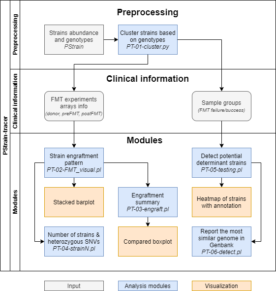

# PStrain-tracer
## What is PStrain-tracer?
PStrain-tracer is a downstream analysis and visulization package of [**PStrain**](https://github.com/wshuai294/PStrain), a tool to infer the genome sequence and propotion of strains from whole genome shotgun metagenomics data.
## What could PStrain-tracer do?

## Installation
PStrain-tracer was written in python3 and perl5, and using R code to do the visualiztion.
```
  git clone https://github.com/deepomicslab/PStrain-tracer.git
```
- Python Dependencies
  - numpy
- Configuration
  - modify the ```config.list``` in the ```src/``` folder
```
Rscript=/where/R/installed/bin/Rscript
R_lib=/where/R/library

MUMmer=/where/MUMmer/install/MUMmer3.23/
fasttree=/where/excutable/FastTree
ass_sum=/where/PStrain-tracer/src/assembly_summary_refseq_20200423.txt
species_marker=/where/PStrain/db/species_markers.txt.gz
marker_gene=/where/PStrain/db/marker_gene.fna.gz
```
If you don't use the module of report the most similar strains from Genbank, you only need modify Rscript and R_lib.
- The R_lib should contains:
  - ggplot2
  - RColorBrewer
  - pheatmap
- For the report the similar strains modules, you need:
  - [**MUMmer**](https://sourceforge.net/projects/mummer/files/mummer/3.23/MUMmer3.23.tar.gz/download)
  - [**FastTree2**](http://www.microbesonline.org/fasttree/)
  - [**Assembly Summary**](https://ftp.ncbi.nlm.nih.gov/genomes/refseq/bacteria/assembly_summary.txt) from NCBI Assemebly FTP.
  - or you can use the ```assembly_summary_refseq_20200423.txt``` we provided in ```src``` folder, but remember gunzip before use.
  - ```species marker``` and ```marker gene``` are provided in [**PStrain**](https://github.com/wshuai294/PStrain).

## Example
We provide an example to run the package in ```example``` folder. ```example.sh``` showed the commands used in a compeleted work.
After your installation and configuration. You can change your direction to the ```example``` folder and directly run ```example.sh``` to figure out if it worked well.
```
# decompressed the demo PStrain inputs
cat demo_PStrain_result.tar.gz.* | tar -zxv 

# Cluster strains based on genotypes
python ../src/PT-01-cluster.py -c config -o demo_PStrain_result --similarity 0.9

# Create the output folder
mkdir output
# Strain engraftment pattern and visualization
perl ../src/PT-02-FMT_visual.pl  -WDR output -LS experimets_list.tsv -PS demo_PStrain_result/ -S 0.9

# Engrafment summary and visualization, default is run with proportion, with '-m abd' will run with original input abundance
perl ../src/PT-03-engraft.pl -WDR output -LS experimets_list.tsv -PS demo_PStrain_result/ -S 0.9
perl ../src/PT-03-engraft.pl -WDR output -LS experimets_list.tsv -PS demo_PStrain_result/ -S 0.9 -m abd

# Number of strains and heterozygous SNVs statistic
perl ../src/PT-04-heterzygousSNV_strainN.pl -WDR output -PS demo_PStrain_result/ -S 0.9

# Detect potential determinant strains with wilcox testing
perl ../src/PT-05-wilcox_testing.pl -WDR output -PS demo_PStrain_result/ -S 0.9 -LS group_info.tsv

# Reporting the most similar genome of the provided strains
perl ../src/PT-06-detect.pl -WDR output -PS demo_PStrain_result/ -S 0.9 -LS strain.txt
```

## Input
- config files, the format you can find at [**PStrain**](https://github.com/wshuai294/PStrain)
- experiments list, a line contrains all samples involved in one FMT experiment follow a sequence of \[donor\] \[recipient\] \[preFMT1\] \[preFMT2\] ... (separated by tab). An example you could find at ```example/experimets_list.tsv```
```
FMT30	FMT103	FMT109
FMT34	FMT101	FMT102	FMT110
FMT33	FMT96	FMT97	FMT98	FMT106
FMT2	FMT51	FMT53
FMT1	FMT5	FMT6	FMT39	FMT41
FMT27	FMT75	FMT77
FMT4	FMT66	FMT67
```
- group info, contrains all samples you want to compare in two groups, one line per sample with sample name and group name, the hander line is needed. An example you could find at ```example/group_info.tsv```
```
sampleID	groupname
FMT1	Success
FMT2	Failure
FMT27	Failure
FMT30	Success
FMT33	Success
FMT34	Success
FMT4	Failure
```
- strains list, the strains you interested in with the format you run after the step1. An example you could find at ```example/strain.txt```
```
Ruminococcus_lactaris_clu-1
Eubacterium_rectale_clu-4
```

## Output
- PT-01  
A new folder name ```merge_[similarity_cutoff]``` will created in the PStrain output folder. Contains ```strain_number.txt``` and ```seq/```. The folder ```seq/``` had sequence and abundance of each strains after clustering.
- PT-02  
A new folder name ```outdir/FMT_visual/``` will created. For each experimet, it had four files: 
  - ```*.xls``` Strain abundace of all samples in this FMT experiment
  - ```*.rela.vis.txt``` Visualization input with strain engraftment pattern annotation of each strain
  - ```*.rela.R``` Visualization script in R format
  - ```*.rela.pdf``` Visualization result in stacked barplot
- PT-03  
A new folder ```outdir/engraft/``` will created. For each experimet, it had three files: 
  - ```*.[propotion/relative].tsv``` Visualization input
  - ```*.[propotion/relative].R``` Visualization script in R format 
  - ```*.[propotion/relative].pdf``` Visualization result in compared boxplot
- PT-04  
A new folder ```outdir/strainN``` will created.
  - ```strainN_heterSNV_stat.*.tsv``` The number of strains number and the corresponding heterozygous SNVs in each species of every samples
- PT-05  
A new folder ```outdir/wilcox_testing/``` will created. For each comparison, the result had nine files:
  - ```*.tsv``` Modified abundance input for strain and species level
  - ```*.group_info``` A copy of group info input for further check
  - ```*.R``` Wilcox-tesing R script
  - ```*.test.tsv``` Wilcox-testing result for strain and species level
  - ```*heatmap*``` Visualization files
- PT-06  
A new folder ```outdir/find_strain``` will created. Foreach strain, a new folder ```outdir/find_strain/[strain_name]``` will created.  
After you run the PT-06 module, you can find three shell in ```outdir/find_strain/[strain_name]```, you need to run them in order.  
The separated shell scripts are made in order to avoid the error in downloading files or calling SNP. Finally, you could find result:
  - ```dl/``` Contains downloaded genome fastas in the same species of your interested strain.
  - ```snp/``` Contains snps calling result of genomes
  - ```tree.nwk``` The phylogenetic tree of interested strains and all strains in the sample species in newick format for further visualization or check.

## Update for MetaPhlAn3 and MetaPhlAn4
### Minium requirements for this step
- Packages
```
Python Bio
Fasttree
MUMmer
```
- [GTDB bacteria metadata **v207**](https://data.gtdb.ecogenomic.org/releases/release207/207.0/bac120_metadata_r207.tar.gz)
```
wget https://data.gtdb.ecogenomic.org/releases/release207/207.0/bac120_metadata_r207.tar.gz
tar -zxvf bac120_metadata_r207.tar.gz
mv src/
```
Download and uncompressed, move to ```src/```

You should use **v207** as the same version MetaPhlAn used in [SGB2GTDB](https://raw.githubusercontent.com/biobakery/MetaPhlAn/master/metaphlan/utils/mpa_vOct22_CHOCOPhlAnSGB_202212_SGB2GTDB.tsv).


### Reporting the most similar genome of the provided strains
```
#For MetaPhlAn3
perl ../src/PT-07-detect.v2.pl -WDR test_M3 -S s__Escherichia_coli -V M3 -I s__Escherichia_coli_seq.txt -N 50 -DBS mpa_v31_CHOCOPhlAn_201901.species_markers.txt.gz -DBM mpa_v31_CHOCOPhlAn_201901.fna.bz2
#For MetaPhlAn4
perl ../src/PT-07-detect.v2.pl -WDR test_M4 -S s__Escherichia_coli -V M4 -I s__Escherichia_coli_seq.txt -N 20 -DBS mpa_vOct22_CHOCOPhlAnSGB_202403.species_markers.txt.gz -DBM mpa_vOct22_CHOCOPhlAnSGB_202403.fna
```
Then will generate shell scripts in ```test_M*/find_strain/s__Escherichia_coli```. Run shell scripts step by step for downloading genomes, detecting SNPs and constructing tree to find the closest genomes for each strain.
### Inputs
- ```-I``` PStrain output of strain sequence e.g. result/seq/s__Escherichia_coli_seq.txt. 

Example:
```
# Gene  Locus   Ref     Alt     str-1   str-2   str-3
562__P64549__K758_00320 30      G       T       0       1       1
562__P64549__K758_00320 72      A       G       1       1       1
562__P64549__K758_00320 140     G       C       1       1       1
562__P64549__K758_00320 196     T       C       1       1       1
562__P64549__K758_00320 204     A       G       1       1       1
562__P64549__K758_00320 210     T       C       1       1       1
562__P64549__K758_00320 213     C       G       1       1       1
562__P64549__K758_00320 222     A       G       1       1       1
562__P64549__K758_00320 246     T       C       1       1       1
```
- ```-DBS``` Species markers file of MetaPhlAn database. Generated using [translate_pkl.py](https://github.com/wshuai294/PStrain/blob/master/scripts/translate_pkl.py) from .pkl file in MetaPhlAn database.

Example: ```python translate_pkl.py mpa_vOct22_CHOCOPhlAnSGB_202403.pkl mpa_vOct22_CHOCOPhlAnSGB_202403.species_markers.txt```

- ```-DBM``` Marker genes fasta file from MetaPhlAn database.
Download and uncompressed from [MetaPhlAn](http://cmprod1.cibio.unitn.it/biobakery3/metaphlan_databases/). Files in .bz2 or .fna or .gz are acceptable.
- [option] ```-N``` The threshold N of genome number. When the genomes in the corresponding species > N, we will randomly select N genomes to construct tree.

 
### Outputs
- tree.nwk A tree of selected genomes and input strain in newick format.
- *sorted_distance.txt For each strain, have an output with genomes in incremental distance.

Example:
```
s__Escherichia_coli_str-1       0.0
GCF_003303795.1_ASM330379v1     0.268918215
GCF_002459435.1_ASM245943v1     0.273527672
GCF_015316785.1_ASM1531678v1    0.273704976
GCF_005395845.1_ASM539584v1     0.27497622299999996
GCF_003334035.1_ASM333403v1     0.27671494
```

  
## Citation
Jiang, Yiqi, et al. "A framework to trace microbial engraftment at the strain level during fecal microbiota transplantation." bioRxiv (2022).
